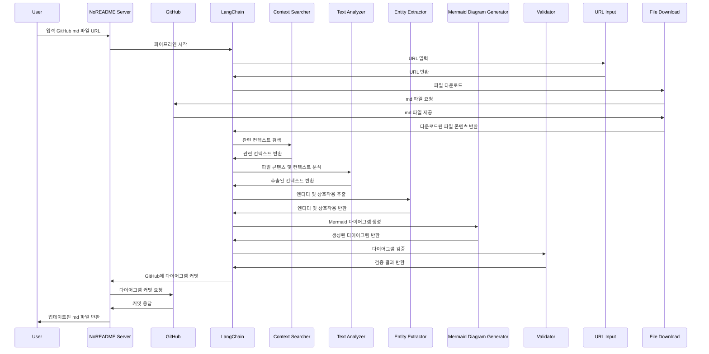

```mermaid
sequenceDiagram
    participant User
    participant NoREADME Server
    participant GitHub
    participant LangChain
    participant Context Searcher
    participant Text Analyzer
    participant Entity Extractor
    participant Mermaid Diagram Generator
    participant Validator

    User->>NoREADME Server: 입력 GitHub md 파일 URL
    NoREADME Server->>LangChain: 파이프라인 시작
    LangChain->>URL Input: URL 입력
    URL Input->>LangChain: URL 반환
    LangChain->>File Download: 파일 다운로드
    File Download->>GitHub: md 파일 요청
    GitHub->>File Download: md 파일 제공
    File Download->>LangChain: 다운로드된 파일 콘텐츠 반환
    LangChain->>Context Searcher: 관련 컨텍스트 검색
    Context Searcher->>LangChain: 관련 컨텍스트 반환
    LangChain->>Text Analyzer: 파일 콘텐츠 및 컨텍스트 분석
    Text Analyzer->>LangChain: 추출된 컨텍스트 반환
    LangChain->>Entity Extractor: 엔티티 및 상호작용 추출
    Entity Extractor->>LangChain: 엔티티 및 상호작용 반환
    LangChain->>Mermaid Diagram Generator: Mermaid 다이어그램 생성
    Mermaid Diagram Generator->>LangChain: 생성된 다이어그램 반환
    LangChain->>Validator: 다이어그램 검증
    Validator->>LangChain: 검증 결과 반환
    LangChain->>NoREADME Server: GitHub에 다이어그램 커밋
    NoREADME Server->>GitHub: 다이어그램 커밋 요청
    GitHub->>NoREADME Server: 커밋 응답
    NoREADME Server->>User: 업데이트된 md 파일 반환
```
[ Groundedness check passed ] 