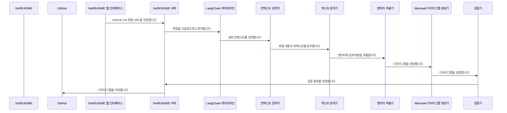

사용자: NoREADME
참여자: GitHub
참여자: NoREADME 웹 인터페이스
참여자: NoREADME 서버
참여자: LangChain 파이프라인
참여자: 컨텍스트 검색기
참여자: 텍스트 분석기
참여자: 엔티티 추출기
참여자: Mermaid 다이어그램 생성기
참여자: 검증기

NoREADME는 개발자가 Git 파일을 자동으로 분석하고, Mermaid 다이어그램을 생성하여 해당 파일에 추가하는 시스템입니다. 이 시스템은 LangChain 파이프라인을 사용하여 파일을 다운로드하고 분석하며, 엔티티와 상호작용을 추출한 후, Mermaid 다이어그램을 생성하고, GitHub에 커밋하여 사용자가 직접 작성하는 번거로움을 줄여줍니다.