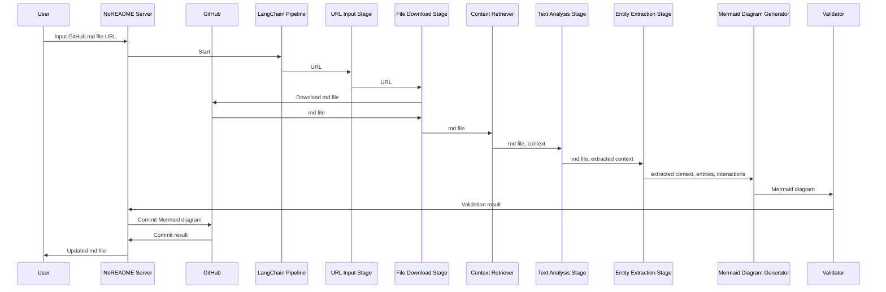

```mermaid
sequenceDiagram
    participant User
    participant NoREADME Server
    participant GitHub
    participant LangChain Pipeline
    participant URL Input Stage
    participant File Download Stage
    participant Context Retriever
    participant Text Analysis Stage
    participant Entity Extraction Stage
    participant Mermaid Diagram Generator
    participant Validator

    User->>NoREADME Server: Input GitHub md file URL
    NoREADME Server->>LangChain Pipeline: Start
    LangChain Pipeline->>URL Input Stage: URL
    URL Input Stage->>File Download Stage: URL
    File Download Stage->>GitHub: Download md file
    GitHub->>File Download Stage: md file
    File Download Stage->>Context Retriever: md file
    Context Retriever->>Text Analysis Stage: md file, context
    Text Analysis Stage->>Entity Extraction Stage: md file, extracted context
    Entity Extraction Stage->>Mermaid Diagram Generator: extracted context, entities, interactions
    Mermaid Diagram Generator->>Validator: Mermaid diagram
    Validator->>NoREADME Server: Validation result
    NoREADME Server->>GitHub: Commit Mermaid diagram
    GitHub->>NoREADME Server: Commit result
    NoREADME Server->>User: Updated md file
```