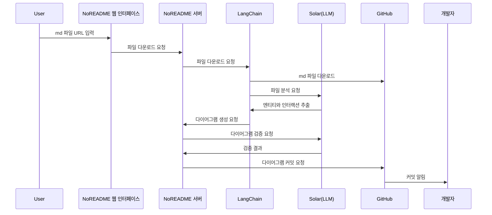

A:

```mermaid
sequenceDiagram
    participant User
    participant NoREADME 웹 인터페이스
    participant NoREADME 서버
    participant LangChain
    participant Solar(LLM)
    participant GitHub
    participant 개발자

    User ->> NoREADME 웹 인터페이스 : md 파일 URL 입력
    NoREADME 웹 인터페이스 ->> NoREADME 서버 : 파일 다운로드 요청
    NoREADME 서버 ->> LangChain : 파일 다운로드 요청
    LangChain ->> GitHub : md 파일 다운로드
    LangChain ->> Solar(LLM) : 파일 분석 요청
    Solar(LLM) ->> LangChain : 엔티티와 인터랙션 추출
    LangChain ->> NoREADME 서버 : 다이어그램 생성 요청
    NoREADME 서버 ->> Solar(LLM) : 다이어그램 검증 요청
    Solar(LLM) ->> NoREADME 서버 : 검증 결과
    NoREADME 서버 ->> GitHub : 다이어그램 커밋 요청
    GitHub ->> 개발자 : 커밋 알림
```