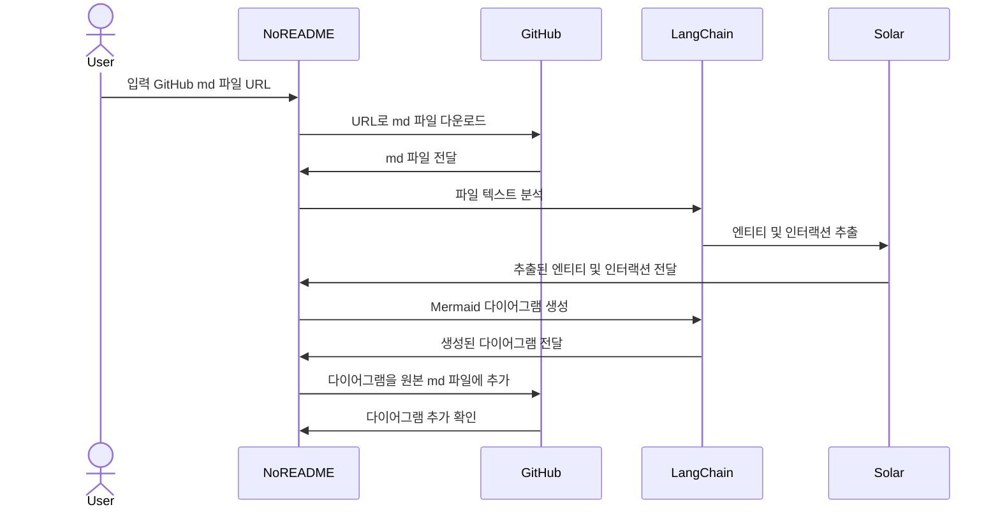

```mermaid
sequenceDiagram
    actor User
    participant NoREADME
    participant GitHub
    participant LangChain
    participant Solar

    User ->> NoREADME : 입력 GitHub md 파일 URL
    NoREADME ->> GitHub : URL로 md 파일 다운로드
    GitHub ->> NoREADME : md 파일 전달
    NoREADME ->> LangChain : 파일 텍스트 분석
    LangChain ->> Solar : 엔티티 및 인터랙션 추출
    Solar ->> NoREADME : 추출된 엔티티 및 인터랙션 전달
    NoREADME ->> LangChain : Mermaid 다이어그램 생성
    LangChain ->> NoREADME : 생성된 다이어그램 전달
    NoREADME ->> GitHub : 다이어그램을 원본 md 파일에 추가
    GitHub ->> NoREADME : 다이어그램 추가 확인
```