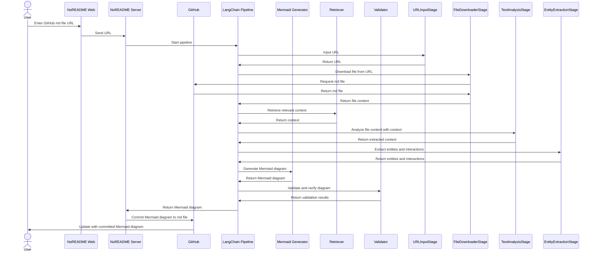

```mermaid
sequenceDiagram
    actor User
    participant NoREADME_Web as NoREADME Web
    participant NoREADME_Server as NoREADME Server
    participant GitHub
    participant LangChain as LangChain Pipeline
    participant Mermaid_Generator as Mermaid Generator
    participant Retriever as Retriever
    participant Validator as Validator

    User ->> NoREADME_Web: Enter GitHub md file URL
    NoREADME_Web ->> NoREADME_Server: Send URL

    NoREADME_Server ->> LangChain: Start pipeline
    LangChain ->> URLInputStage: Input URL
    URLInputStage ->> LangChain: Return URL

    LangChain ->> FileDownloaderStage: Download file from URL
    FileDownloaderStage ->> GitHub: Request md file
    GitHub ->> FileDownloaderStage: Return md file
    FileDownloaderStage ->> LangChain: Return file content

    LangChain ->> Retriever: Retrieve relevant context
    Retriever ->> LangChain: Return context

    LangChain ->> TextAnalysisStage: Analyze file content with context
    TextAnalysisStage ->> LangChain: Return extracted context

    LangChain ->> EntityExtractionStage: Extract entities and interactions
    EntityExtractionStage ->> LangChain: Return entities and interactions

    LangChain ->> Mermaid_Generator: Generate Mermaid diagram
    Mermaid_Generator ->> LangChain: Return Mermaid diagram

    LangChain ->> Validator: Validate and verify diagram
    Validator ->> LangChain: Return validation results

    LangChain ->> NoREADME_Server: Return Mermaid diagram

    NoREADME_Server ->> GitHub: Commit Mermaid diagram to md file
    GitHub ->> User: Update with committed Mermaid diagram
```
