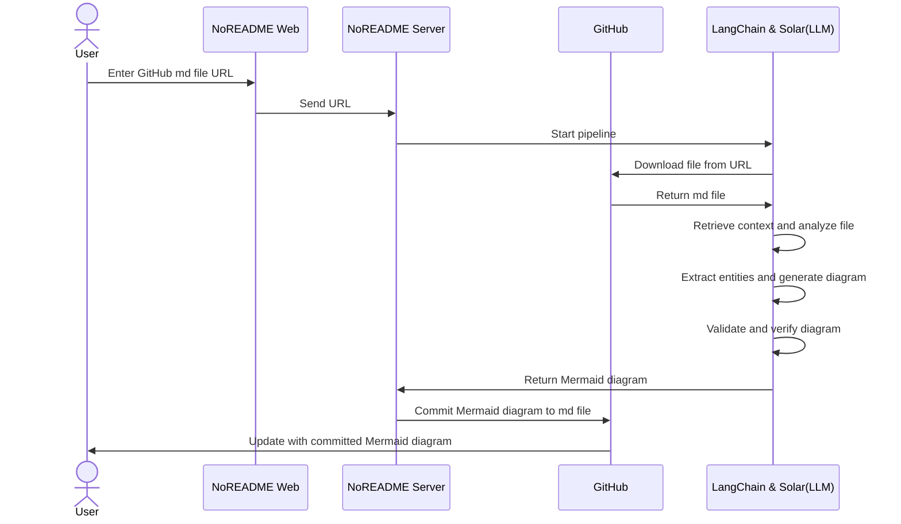

```mermaid
sequenceDiagram
    actor User
    participant NoREADME_Web as NoREADME Web
    participant NoREADME_Server as NoREADME Server
    participant GitHub
    participant LangChain as LangChain & Solar(LLM)

    User ->> NoREADME_Web: Enter GitHub md file URL
    NoREADME_Web ->> NoREADME_Server: Send URL

    NoREADME_Server ->> LangChain: Start pipeline
    LangChain ->> GitHub: Download file from URL
    GitHub ->> LangChain: Return md file

    LangChain ->> LangChain: Retrieve context and analyze file
    LangChain ->> LangChain: Extract entities and generate diagram
    LangChain ->> LangChain: Validate and verify diagram

    LangChain ->> NoREADME_Server: Return Mermaid diagram
    NoREADME_Server ->> GitHub: Commit Mermaid diagram to md file
    GitHub ->> User: Update with committed Mermaid diagram
```
